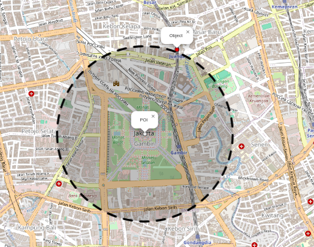
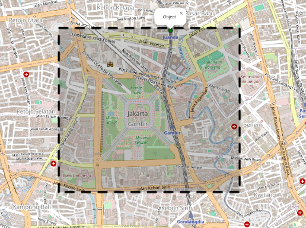
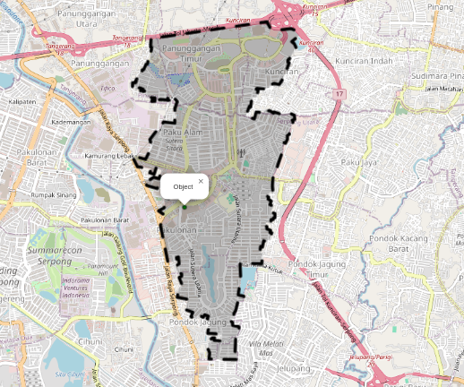
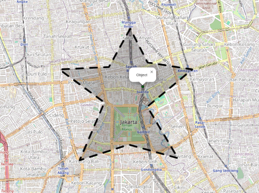
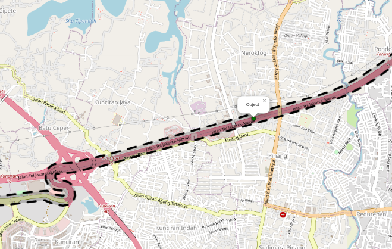

# Geofencing using Python

## Description
This project provides examples of how to implement geofencing using python. Files provided:

- geofencing.py: module for geofencing
- geofencing.ipynb: jupyter notebook provides examples of how to use the geofencing module and other tips

There are four types of geofencing provided:

- **Circular geofencing**

    Simple geofencing within a radius of a point of interest

    

- **Rectangular geofencing**

    Simple geofencing of an area using a rectangle

    

- **Polygonal geofencing**

    Geofencing a more complex area (e.g. cities, residential areas, etc.) using polygons

    
    

- **Corridor geofencing**

    For geofencing roads and routes

    

## Prerequisites
Python version: 3.11.9
```bash
# Install dependencies
pip install -r requirements.txt